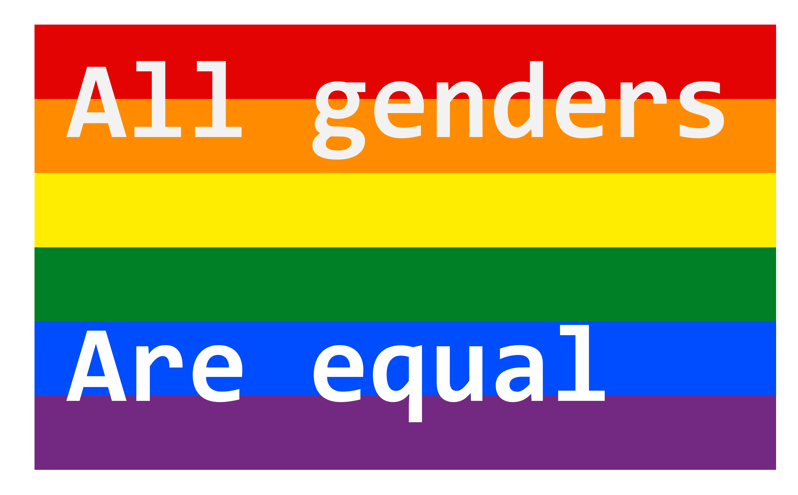

* [Install](./section/note/install.md)

* [Python API list](./section/use/api.md)

* [Command-line interface](./section/use/cli.md)

* <a href="https://github.com/Augus1999/ChemBFN-WebUI" target="_blank">Web user interface </a>

* [Publications](./section/note/publication.md)

* [Research Blog](./section/note/blog.md)

